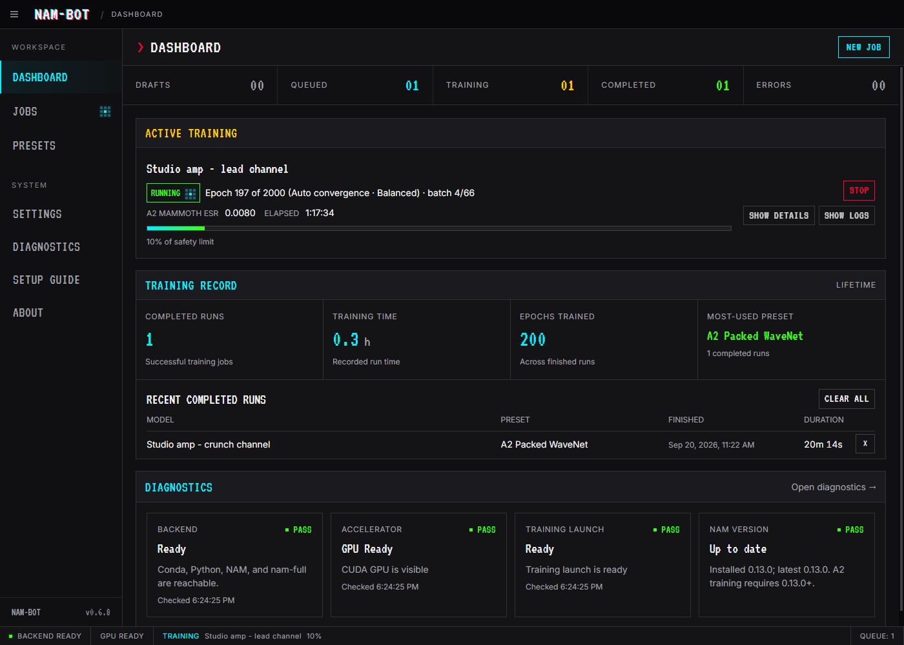
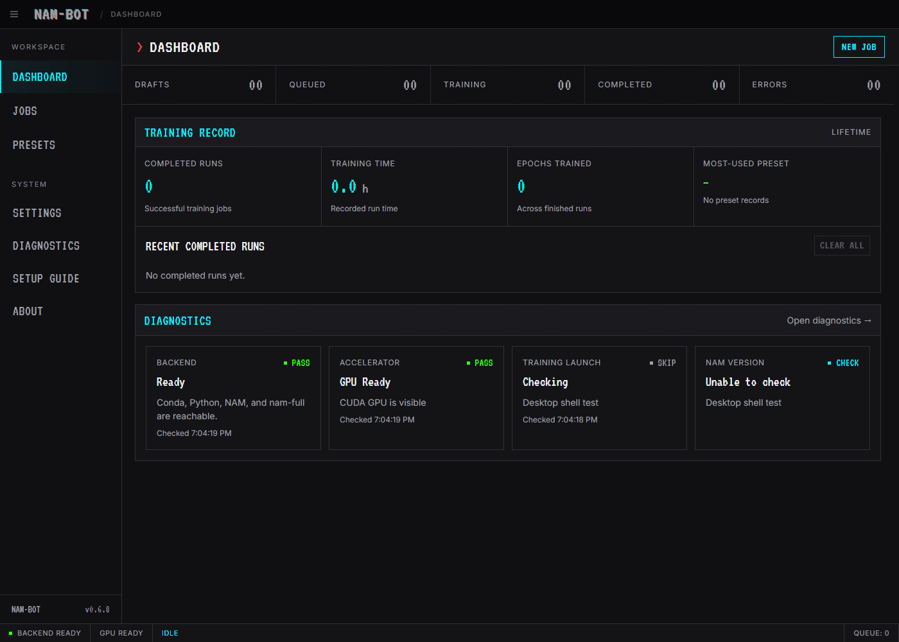
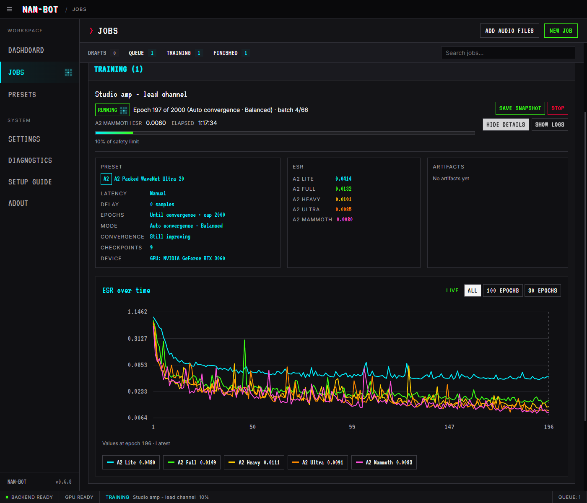
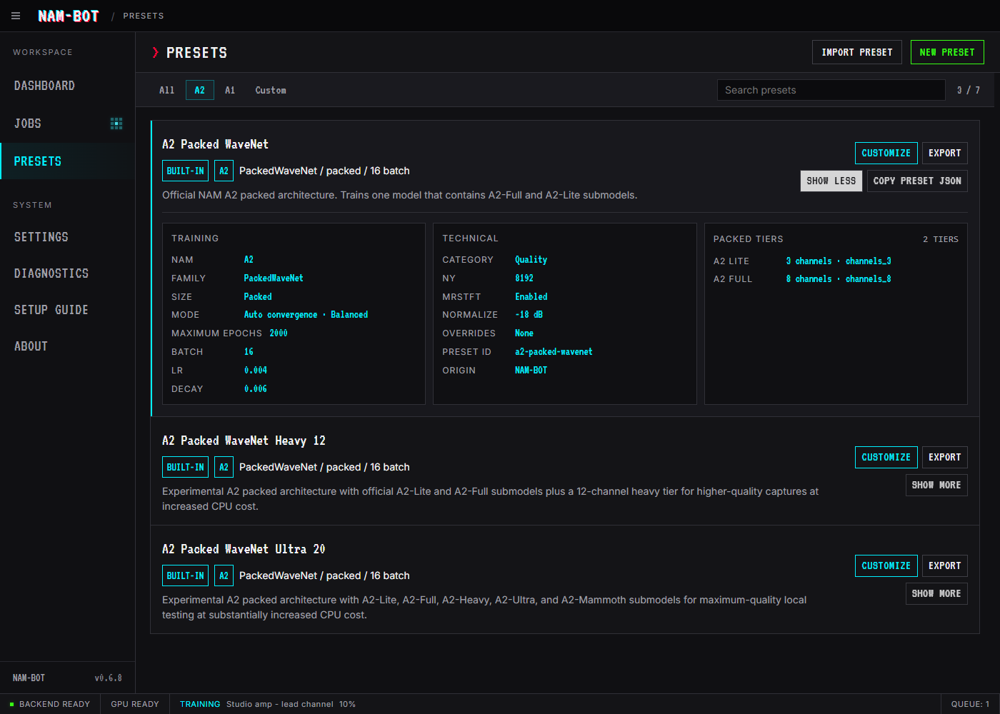
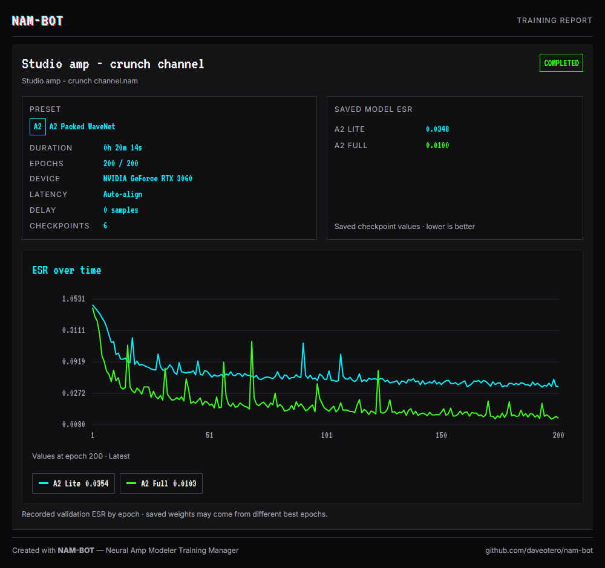

# NAM-BOT

<p align="center">
  
</p>

<p align="center">
  A desktop control room for local Neural Amp Modeler training.
</p>

NAM-BOT helps you turn recordings of your amps and pedals into [Neural Amp Modeler](https://github.com/sdatkinson/neural-amp-modeler) models on your own computer. Create jobs, queue captures, and follow training without managing each run in a terminal. If you are new to local NAM training, the app's Setup Guide and Diagnostics help you get the Python environment working too.

Reusable, shareable presets give you room to experiment, including custom packed models with more tiers and larger networks when you want to pursue higher-quality captures.

**[Download NAM-BOT](https://github.com/daveotero/nam-bot/releases/latest)** · [Get started](#install-and-set-up) · [Train your first model](#train-your-first-model) · [User guides](#user-guides) · [Report a problem](https://github.com/daveotero/nam-bot/issues)



Screenshots use example session names and paths, with recorded training curves.

## What you can do

- Create individual jobs or batches, reorder waiting jobs, and reuse earlier runs as templates.
- Train with A2 Standard or A1 presets. Customize recipes, choose packed model tiers, and import or export presets with creator attribution.
- Monitor progress, validation error, and live terminal logs from Jobs or Dashboard.
- Connect your local Conda environment and diagnose Python, GPU, or training-launch problems from the app.
- Export `.nam` models with names and metadata you choose, save snapshots during training, and optionally keep image or HTML reports.

## Install and set up

### What you need

NAM-BOT uses a separate **Conda environment containing NAM and PyTorch** to do the training. Installing the desktop app does not install that environment. A2 training requires `neural-amp-modeler` 0.13.0 or newer.

| Computer                    | App download                    | Training options and setup instructions                                                                                                                                                              |
| --------------------------- | ------------------------------- | ---------------------------------------------------------------------------------------------------------------------------------------------------------------------------------------------------- |
| Windows 10 or 11, x64       | Windows installer (`Win64.exe`) | [CPU](./docs/setup-guide.md#standard--cpu-windows), [NVIDIA CUDA](./docs/setup-guide.md#nvidia-cuda-windows), or [AMD ROCm on supported Windows 11 hardware](./docs/setup-guide.md#amd-rocm-windows) |
| Mac with Apple Silicon      | macOS `arm64.dmg`               | [Apple Silicon setup](./docs/setup-guide.md#apple-silicon), using Metal Performance Shaders (MPS) for GPU training                                                                                   |
| Mac with an Intel processor | macOS `x64.dmg`                 | [Intel Mac compatibility](./docs/setup-guide.md#intel-mac-compatibility); CPU training needs a compatible Python/NAM/PyTorch environment                                                             |

CPU training is available; a supported GPU can make training much faster. GPU support depends on the exact hardware, driver, operating system, and PyTorch build. In particular, AMD support does not cover every Radeon card, and an Intel Mac app build does not guarantee compatibility with the latest Python training packages. The linked setup paths explain those requirements.

Download your build from [GitHub Releases](https://github.com/daveotero/nam-bot/releases/latest). Run the Windows installer, or open the matching Mac disk image and drag NAM-BOT into Applications. The macOS builds are unsigned; if macOS blocks the first launch, follow [Apple's instructions for opening an app from an unidentified developer](https://support.apple.com/en-us/102445).

### Already have NAM working?

You can usually reuse your existing Conda environment.

1. Open **Settings**. NAM-BOT looks for Conda on your system path and an environment named `nam`; if those are correct, leave them as they are.
2. Otherwise, choose the Conda executable and select your environment by name or full folder path. Settings save automatically; wait for **Saved**. Direct Python executables and standalone virtual environments are not supported.
3. Open **Diagnostics** and choose **Re-check All**. Confirm that the environment and training-launch checks pass, and that the accelerator matches the CPU or GPU you plan to use.

### Starting from scratch?

1. Follow [Install Conda](./docs/setup-guide.md#install-conda) to install Miniconda, or use an existing Anaconda installation.
2. Open **Anaconda Prompt** on Windows or **Terminal** on macOS. On Apple Silicon, use the Apple Silicon Conda installer.
3. Follow the hardware-specific setup path in the table above to create a `nam` environment, install the appropriate PyTorch build, and install NAM. Those guides include the commands and checks for each platform.
4. Return to NAM-BOT and connect the environment in **Settings**, then run **Diagnostics → Re-check All**.

The app includes a **Setup Guide** too. If a check fails, use the suggested repair in Diagnostics or the [troubleshooting section below](#diagnostics-and-help) before queueing a job. **Backend** readiness confirms the packages can be reached; **Training Launch** separately checks whether the trainer can start.

## Train your first model

Start with a matching audio pair: the dry signal you played into your gear and the recording of that gear's output. NAM-BOT trains from these files. Recording the capture happens in your audio setup; listening to the finished model happens in a compatible NAM player or plugin.

1. Open **Jobs → New Job**, or choose **Add audio files** and select a captured output recording. Dropping one recording into Jobs opens its editor immediately; multiple files open the batch editor.
2. Give the job a name and check both audio fields. **Input audio** is the dry training signal; **Output audio** is the recording from your gear. Choose **Default** input only if you used the bundled NAM V3 signal for the capture; otherwise choose **Custom** and select the actual signal you used. **Save Default to Disk** exports the bundled signal when preparing a new capture.
3. Choose a preset. **A2 Standard** is the initial default and a useful starting point. A1 presets are also available. A preset stores the reusable training recipe; a job supplies the audio and output choices.
4. Check **Latency**. **Auto-align** measures delay for recognized NAM training signals. With an unrecognized custom signal, select **Manual** and supply its known delay in samples.
5. Choose the training mode. **Auto convergence** can finish when improvements settle; **Fixed epochs** uses the number of passes through the training data you specify. The default A2 preset uses **Balanced** auto convergence with a 2,000-epoch maximum.
6. Choose the **Model output** folder for the finished `.nam` file. Add model/creator metadata or filename options if useful. Reports are optional. This folder is separate from **Settings → Folders → Workspace Root**, which holds run files and logs.
7. Choose **Save Job**, then **Queue** on the saved draft. The button shows **Queueing...** while NAM-BOT validates the job and freezes its settings. Follow progress in **Jobs** or **Dashboard**.
8. When the run succeeds, choose **Open Folder** on its card to find the exported model. Load it in a compatible player, such as the [Neural Amp Modeler plugin](https://github.com/sdatkinson/NeuralAmpModelerPlugin); check the player's support for your chosen model architecture.

The example below creates a job with the larger **Ultra 20** preset and optional reports. You can follow the same workflow with the default preset.



## Manage and monitor your jobs

Jobs keeps drafts, waiting jobs, active training, and finished runs together. Add several recordings to create a batch with a shared recipe, or use **Use as Template** on a finished run for another set of captures. Search helps you find jobs as the list grows.

Training jobs run one at a time in queue order. Queued jobs retain their preset and settings even if you edit the library later. Reorder waiting jobs by dragging them; choose **Unqueue** to return one to drafts for editing. After restarting NAM-BOT, choose **Resume Queue** to continue saved waiting jobs. A card marked **Diagnostics needed** links to the checks required before training can begin.

During a run, **Show Details** displays device information, checkpoints, and the ESR graph. ESR (error-to-signal ratio) measures how closely the model matches the reference recording; lower values mean less measured error. **Show Logs** displays the trainer's live terminal output. Dashboard gives you an overview of active training, recent results, lifetime totals, and environment readiness.



With auto convergence, **Fast**, **Balanced**, and **Obsessive** control how long training watches for smaller improvements before finishing, within the maximum epoch count. Fixed-epoch runs also show convergence feedback. These indicators help you judge progress; they do not guarantee that further training cannot improve a capture.

On the **Jobs** card, **Save Snapshot** exports the best validated checkpoints and lets training continue. **Stop** offers **Save & stop**, **Discard & stop**, or **Keep training**; saving requires an available validated checkpoint. A successful normal run saves its model automatically. The [Jobs guide](./docs/jobs-system.md) explains the stopping rules, queue recovery, and saved-model results.

## Choose, customize, and share presets

Open **Presets** to browse reusable recipes. Choose **Customize** on a built-in preset to make your own copy, then adjust its training settings or advanced JSON overrides. Select your preferred starting recipe under **Settings → Application → Default preset**.

Use **Export** on a preset to share its file with another NAM-BOT user. They can add it with **Import Preset**. Creator name and URL travel with the recipe; audio files and job output choices remain separate.

### Experiment with larger packed models

An A2 packed `.nam` contains several submodels trained together, giving you different model sizes from one run. Custom presets let you define compatible tiers and channel counts, which control network width. Larger networks offer more capacity to pursue higher-quality captures, at the cost of training resources and playback processing power.

| Built-in A2 preset      | Packed channel counts |
| ----------------------- | --------------------- |
| Packed WaveNet          | 3, 8                  |
| Packed WaveNet Heavy 12 | 3, 8, 12              |
| Packed WaveNet Ultra 20 | 3, 8, 12, 16, 20      |

For packs with three or more tiers, the job's **Packed models** checklist lets you train all tiers or a selected subset. Compare their ESR and listen to the results to decide which suits your capture. The [Presets guide](./docs/presets-system.md) covers everyday editing, sharing, and expert overrides; NAM's [packed-training reference](https://github.com/sdatkinson/neural-amp-modeler/blob/main/docs/source/tutorials/packed-training.rst) explains compatible custom configurations.



## Keep a record of the results

Under **Model output → Training reports**, optionally enable a PNG image, an interactive HTML report, or both. They accompany model saves, including snapshots and **Save & stop**, and become defaults for new jobs. You can also choose **Save Report** on a finished Jobs card. HTML reports work offline; reports omit local folder paths, terminal logs, and private job notes.

For saved models, reports use the exported checkpoints' ESR, which may differ from the latest graph point. Reports without a saved model label the available measurements accordingly. See [training reports](./docs/jobs-system.md#branded-training-reports) for details.

<details>
<summary>Example PNG training report</summary>



</details>

## Diagnostics and help

Diagnostics checks **Backend**, **Accelerator**, **Training Launch**, and **NAM Version**. It inspects Conda, Python, NAM, PyTorch, Lightning, GPU visibility, and the process used to start training. The **Actions** section prioritizes problems and supplies repair commands; use **Re-check All** after making changes.

| Problem                                  | Where to start                                                                                                                                                           |
| ---------------------------------------- | ------------------------------------------------------------------------------------------------------------------------------------------------------------------------ |
| Conda or NAM cannot be found             | Check the Conda executable and environment name/folder in Settings. See [connecting an existing environment](./docs/setup-guide.md#connect-an-existing-nam-environment). |
| The expected GPU is missing              | Check the driver and PyTorch installation for your hardware. CPU-only status is expected when you chose CPU training.                                                    |
| Backend passes, but a job will not start | Check **Training Launch** and **NAM Version**. A2 requires NAM 0.13.0 or newer. A paused queue may also need **Resume Queue**.                                           |
| A run fails after starting               | Read its **Show Logs** output and the error on its card. **Create Draft** makes an editable copy for another attempt.                                                    |

For more detail, open **Advanced details → Show Details**, then use **Copy AI Prompt** or **Copy Raw JSON**. These exports include environment paths and machine details, so review them before sharing with a helper or an AI assistant. The [Diagnostics guide](./docs/diagnostics.md) explains the checks. When [reporting an issue](https://github.com/daveotero/nam-bot/issues), include the app version, operating system, what you tried, and the relevant error or diagnostics.

NAM-BOT blocks the compromised Lightning versions `2.6.2` and `2.6.3` before importing them. If either was installed in your environment, follow the [Lightning security advisory](https://github.com/Lightning-AI/pytorch-lightning/security/advisories/GHSA-w37p-236h-pfx3) and the [setup guide's security and repair instructions](./docs/setup-guide.md#lightning-security-block).

## User guides

| I want to                                                      | Read                                 |
| -------------------------------------------------------------- | ------------------------------------ |
| Install NAM and connect my hardware                            | [Setup guide](./docs/setup-guide.md) |
| Create batches, manage the queue, or export models and reports | [Jobs](./docs/jobs-system.md)        |
| Build, customize, or share a recipe                            | [Presets](./docs/presets-system.md)  |
| Understand training activity and lifetime totals               | [Dashboard](./docs/dashboard.md)     |
| Change my environment or application defaults                  | [Settings](./docs/settings.md)       |
| Work through a setup or launch problem                         | [Diagnostics](./docs/diagnostics.md) |

For release history, see the [changelog](./CHANGELOG.md). Developer references are under [Run from source](#run-from-source).

## Why I built this

I got pulled into Neural Amp Modeler through the kind of open-source rabbit hole that sticks with you: public repos, a command-line workflow, learning by doing, and a generous community willing to help.

These days, I often use Tone 3000 because it is fast, polished, and sounds great. But I missed some of that DIY experimentation, especially the ability to push into bigger or weirder local training setups just because it is interesting to try.

NAM-BOT came out of that feeling. I wanted local training to feel approachable while keeping room to tinker, whether you already know your way around Python and Conda or are still figuring out what those words mean.

The station log leaves a few frequencies unlisted. They tend to carry further after hours.

## Run from source

NAM-BOT uses Electron, React, and TypeScript. For app development, use Node.js 22.12 or later in the 22.x series used by CI, plus npm, then run:

```bash
git clone https://github.com/daveotero/nam-bot.git
cd nam-bot
npm ci
npm run dev
```

`npm ci` installs the locked dependencies. `npm run dev` launches the Electron app with hot reload; training still uses the Conda environment configured in Settings.

| Command               | Purpose                                                                           |
| --------------------- | --------------------------------------------------------------------------------- |
| `npm run check`       | Type-check the app and tests, run the test suite, then build all Electron targets |
| `npm run build`       | Build the main process, preload, and renderer into `out/`                         |
| `npm run preview`     | Open the production build locally                                                 |
| `npm run package:win` | Build and package the Windows installer into `release/`                           |
| `npm run package:mac` | Build and package the macOS DMGs, then verify the bundled training-launch helper  |

For platform build details, see [macOS support](./docs/macos-support.md). Contributor references cover the [desktop shell](./docs/desktop-shell.md), [UI style guide](./docs/ui-style-guide.md), and [release workflow](./docs/release-workflow.md).

## License

MIT. See [LICENSE.md](./LICENSE.md).
