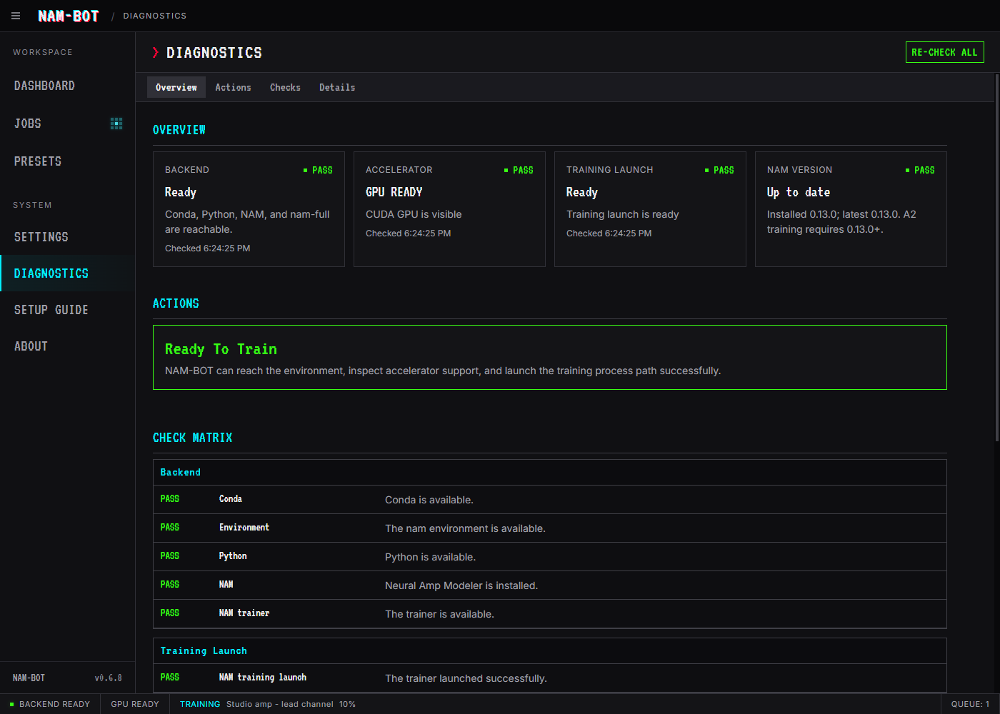

# Set up NAM-BOT

NAM-BOT needs a Conda environment containing Neural Amp Modeler and PyTorch. The desktop installer installs the app; the steps below prepare the Python environment that does the training. A2 presets require `neural-amp-modeler` 0.13.0 or newer.

- [Connect an existing NAM environment](#connect-an-existing-nam-environment)
- [Create a new environment](#create-a-new-environment)
- [Check Diagnostics](#check-diagnostics)
- [Train your first model](#train-your-first-model)
- [Troubleshoot setup](#troubleshoot-setup)

## Install the desktop app

Download a build from [NAM-BOT releases](https://github.com/daveotero/nam-bot/releases). Use the Windows installer for Windows, or the matching Apple Silicon (`arm64`) or Intel (`x64`) DMG for macOS. On Mac, open the DMG and move NAM-BOT into Applications before launching it.

If macOS blocks an unsigned download, follow [Apple's instructions for opening apps safely](https://support.apple.com/en-us/102445). Only allow an app after checking where it came from.

## Connect an existing NAM environment

If you already train NAM models in Conda, start with that environment. NAM-BOT supports environments selected by name or by their full folder path. Direct Python executables and standalone virtual environments are not supported.

Open an Anaconda Prompt on Windows or your Conda-enabled Terminal on macOS. List your environments:

```bash
conda env list
```

Conda shows each environment's name and folder. Use the one where NAM is installed. See [Conda's environment guide](https://docs.conda.io/projects/conda/en/latest/user-guide/tasks/manage-environments.html) if you need to identify it.

In NAM-BOT, open **Settings** and fill in the Backend section:

| Setting | What to select |
| --- | --- |
| Conda Executable Path | Use the discovered Conda installation, or choose Custom Path and browse to its executable. On Windows this is usually `Scripts\conda.exe` inside your Miniconda/Anaconda folder; on macOS, `bin/conda`. |
| Backend Mode | Choose Conda Environment Name or Conda Environment Prefix. |
| Environment Name | Enter the name from the list, such as `nam`. |
| Environment Prefix Path | When using prefix mode, enter the full environment folder, rather than the `python` executable inside it. |

The initial environment name is `nam`. If NAM-BOT finds Conda and your environment already uses that name, the defaults may be enough.

Settings save automatically. Wait for **Saved** in the toolbar, then open [Diagnostics](#check-diagnostics). **Validate Backend** in Settings also saves the visible settings before checking them.

## Create a new environment

### Install Conda

Install [Miniconda](https://www.anaconda.com/docs/getting-started/installation), or use an existing Anaconda installation. On Windows, accept the installer defaults and open **Anaconda Prompt** from the Start menu afterward, as described in [Conda's Windows installation guide](https://docs.conda.io/projects/conda/en/latest/user-guide/install/windows.html). NAM-BOT can use a full executable path, so adding Conda to the global PATH is optional.

On Apple Silicon, choose the Apple Silicon installer and use Terminal. Follow the installer's shell-initialization instructions, then open a new terminal window.

Run the commands for your chosen path in that terminal. `conda activate nam` selects the environment; `python -m pip` installs packages into its Python. If you already have an environment named `nam`, use the existing-environment instructions above or choose a different name and enter that name in Settings.

| Your machine | Setup path |
| --- | --- |
| Windows, using CPU or unsure about the GPU | [Standard / CPU](#standard--cpu-windows) |
| Windows with an NVIDIA GPU | [NVIDIA CUDA](#nvidia-cuda-windows) |
| Windows with a supported AMD GPU | [AMD ROCm](#amd-rocm-windows) |
| Apple Silicon Mac | [Apple Silicon](#apple-silicon) |
| Intel Mac | [Intel Mac compatibility](#intel-mac-compatibility) |

### Standard / CPU (Windows)

Create an environment and install the CPU build of PyTorch:

```bash
conda create -n nam python=3.11 -y
conda activate nam
python -m pip install torch --index-url https://download.pytorch.org/whl/cpu
```

This path trains on the processor. You can install a GPU build later if your hardware supports one. The [PyTorch installation selector](https://pytorch.org/get-started/locally/) also provides the CPU command for Windows. Continue with [Install Neural Amp Modeler](#install-neural-amp-modeler).

### NVIDIA CUDA (Windows)

Create and activate the environment:

```bash
conda create -n nam python=3.11 -y
conda activate nam
```

Open the [PyTorch installation selector](https://pytorch.org/get-started/locally/). Choose the stable release, Windows, Pip, Python, and a CUDA version supported by your GPU and driver. Run its generated installation command in the activated `nam` environment. NAM's [installation guide](https://github.com/sdatkinson/neural-amp-modeler/blob/main/docs/source/installation.rst) also recommends installing the appropriate PyTorch build before NAM.

If you are replacing a different PyTorch build in an existing environment, remove it before running the chosen installation command:

```bash
python -m pip uninstall -y torch torchvision torchaudio
```

Check that PyTorch can see the GPU:

```bash
python -c "import torch; print('Torch:', torch.__version__); print('CUDA build:', torch.version.cuda); print('GPU available:', torch.cuda.is_available()); print('GPU:', torch.cuda.get_device_name(0) if torch.cuda.is_available() else 'Not detected')"
```

Expect a CUDA build value, `GPU available: True`, and your GPU's name. If it prints `False`, check the selected wheel and driver requirements before starting training. Continue with [Install Neural Amp Modeler](#install-neural-amp-modeler).

### AMD ROCm (Windows)

Check your exact GPU and operating system in [AMD's Windows support matrix](https://rocm.docs.amd.com/projects/radeon-ryzen/en/latest/docs/compatibility/compatibilityrad/windows/windows_compatibility.html) first. Support applies to individual GPU models, not every card in a Radeon series. The ROCm 7.2.1 matrix lists Windows 11 and Python 3.12.

Create a Python 3.12 environment:

```bash
conda create -n nam python=3.12 -y
conda activate nam
```

Follow [AMD's native Windows PyTorch installation instructions](https://rocm.docs.amd.com/projects/radeon-ryzen/en/latest/docs/install/installrad/windows/install-pytorch.html) in this activated environment. Install the required graphics driver, then complete both the ROCm environment packages and PyTorch package steps. Use the command block for your shell: Anaconda Prompt uses CMD syntax; Anaconda PowerShell Prompt uses PowerShell syntax. Keep the SDK and PyTorch packages from the same documented release.

Check GPU visibility:

```bash
python -c "import torch; print('GPU available:', torch.cuda.is_available()); print('HIP version:', torch.version.hip); print('GPU:', torch.cuda.get_device_name(0) if torch.cuda.is_available() else 'Not detected')"
```

Expect `GPU available: True`, a HIP version, and your AMD GPU's name. ROCm uses PyTorch's `torch.cuda` API; that name is normal on AMD. NAM-BOT uses the HIP version to distinguish ROCm from NVIDIA CUDA. Continue with [Install Neural Amp Modeler](#install-neural-amp-modeler).

### Apple Silicon

Use an Apple Silicon Conda installation. Check [Apple's PyTorch requirements](https://developer.apple.com/metal/pytorch/) for your macOS version and install the Xcode command-line tools if needed:

```bash
xcode-select --install
```

Create the environment and install PyTorch:

```bash
conda create -n nam python=3.11 -y
conda activate nam
python -m pip install torch
```

Check Metal Performance Shaders (MPS), the GPU backend used on Apple Silicon:

```bash
python -c "import torch; print('Torch:', torch.__version__); print('MPS available:', torch.backends.mps.is_available())"
```

Expect `MPS available: True` for GPU training. If it is `False`, check the macOS, Python architecture, and PyTorch requirements in Apple's guide. Continue with [Install Neural Amp Modeler](#install-neural-amp-modeler).

### Intel Mac compatibility

NAM-BOT has an Intel Mac app build, but the Python training dependencies have their own limits. PyTorch stopped official Intel Mac binaries after the 2.2 series; see the [PyTorch announcement](https://pytorch.org/blog/pytorch2-2/). Connect an existing compatible NAM Conda environment when available. A fresh Intel setup needs compatible older dependencies and is not covered by the Apple Silicon commands above.

### Install Neural Amp Modeler

Once PyTorch is installed, run these commands in the same activated environment:

```bash
python -m pip install --upgrade "neural-amp-modeler>=0.13.0"
python -m pip show neural-amp-modeler
python -m pip check
```

The first command installs NAM, the second shows its installed version, and the third checks for dependency conflicts. NAM 0.13 added the Packed WaveNet training used by NAM-BOT's A2 presets. See the [NAM release notes](https://github.com/sdatkinson/neural-amp-modeler/releases/tag/v0.13.0).

Return to NAM-BOT and [connect this environment in Settings](#connect-an-existing-nam-environment). If you used `nam`, select Conda Environment Name and enter `nam`.

## Check Diagnostics

Open **Diagnostics**. Checks load automatically; choose **Re-check All** after changing an environment or installing packages.



The screenshot uses an example NVIDIA setup. Your accelerator and environment details will reflect your own machine.

| Check | What you need |
| --- | --- |
| Backend | NAM-BOT can reach Conda, the selected environment, Python, and NAM. |
| Accelerator | PyTorch sees the GPU you intend to use. CPU-only status is expected for the Standard path. |
| Training Launch | NAM-BOT can start the terminal process used by training and write to the workspace. |
| NAM Version | Version 0.13.0 or newer for A2 presets. |

If a check fails, follow the primary repair sequence in **Actions**, including any installation commands, then choose **Re-check All**. Backend readiness alone does not confirm that the training process can launch.

For more detail, see the [Diagnostics guide](diagnostics.md).

## Train your first model

You need a matching audio pair: the dry signal sent into your gear and the recording of its output. If you used the bundled NAM V3 signal to make the capture, choose **Default** input. Otherwise choose **Custom** and select the actual dry signal you used. You can export the bundled signal with **Save Default to Disk** when preparing a new capture.

1. Open **Jobs** and choose **New Job**, or add a captured output file with **Add audio files**.
2. Check the input signal and output recording. Give the job a name.
3. Choose a preset and training mode. The initial default is **A2 Standard**, with **Balanced auto convergence** and a 2,000-epoch maximum. Auto convergence can finish earlier; Fixed epochs uses your chosen epoch count.
4. Review latency and the model output folder. **Auto-align** works with recognized NAM training signals. For an unrecognized custom input, use a known manual delay.
5. Choose any filename options, extra final-model copy, or PNG/HTML training reports you want.
6. Select **Save Job**, then **Queue** on the draft. Monitor training in Jobs or Dashboard. Open the finished card's model or output-folder link to find the exported `.nam` file.

The model output folder holds training results. **Settings > Folders > Workspace Root** separately controls temporary run files and logs. Read the [Jobs guide](jobs-system.md) for batches, snapshot exports, stop choices, and reports, or the [Presets guide](presets-system.md) for recipe options.

After restarting NAM-BOT, choose **Resume Queue** to continue saved waiting jobs. A card labeled **Diagnostics needed** links to the checks required before it can start.

## Troubleshoot setup

| Problem | Next step |
| --- | --- |
| Conda works in your terminal but NAM-BOT cannot find it | Set the full Conda executable path in Settings. On Windows, use `where.exe conda` in Anaconda Prompt to help locate it; choose the executable rather than a batch wrapper. |
| NAM is installed, but Diagnostics checks a different environment | Compare Settings with `conda env list`. In that environment, `python -m pip show neural-amp-modeler` confirms the installed package. |
| Backend passes but Training Launch fails | Follow the Training Launch action in Diagnostics. On macOS, run the app from Applications; also check that Workspace Root is writable. |
| The expected GPU is missing | Revisit the matching PyTorch installation path above. Installing NAM by itself does not confirm the right GPU build or driver. |
| A2 is waiting for version confirmation | Run Diagnostics or Re-check All. A confirmed compatible version releases a diagnostics-blocked queue during the same session; a queue paused after restart still needs Resume Queue. |
| You need help interpreting a failure | Open Advanced details, choose Show Details, then Copy AI Prompt or Copy Raw JSON. Review the preview before sharing: diagnostics include local environment paths and machine details. |

### Lightning security block

NAM-BOT checks package metadata before importing NAM or Lightning. It blocks known compromised `lightning` or `pytorch-lightning` versions 2.6.2 and 2.6.3. You can inspect the selected environment without importing those packages:

```bash
conda activate nam
python -m pip show lightning pytorch-lightning
```

Replace `nam` with your environment name when necessary. If either affected version was installed, follow the [Lightning maintainers' security advisory](https://github.com/Lightning-AI/pytorch-lightning/security/advisories/GHSA-w37p-236h-pfx3): treat the environment as potentially compromised, rotate exposed credentials, and rebuild affected systems from a known clean state. Reinstalling the Python package alone does not address possible credential exposure.

For the package repair, the current NAM dependency constraint is `pytorch-lightning<=2.6.1`, and the advisory recommends 2.6.1. Once the affected environment has been addressed, use:

```bash
python -m pip uninstall -y lightning pytorch-lightning
python -m pip install "pytorch-lightning==2.6.1"
python -m pip install --upgrade "neural-amp-modeler>=0.13.0"
python -m pip check
```

The constraint is recorded in [NAM's dependency file](https://github.com/sdatkinson/neural-amp-modeler/blob/main/pyproject.toml). Return to NAM-BOT and choose **Re-check All** after repair.
